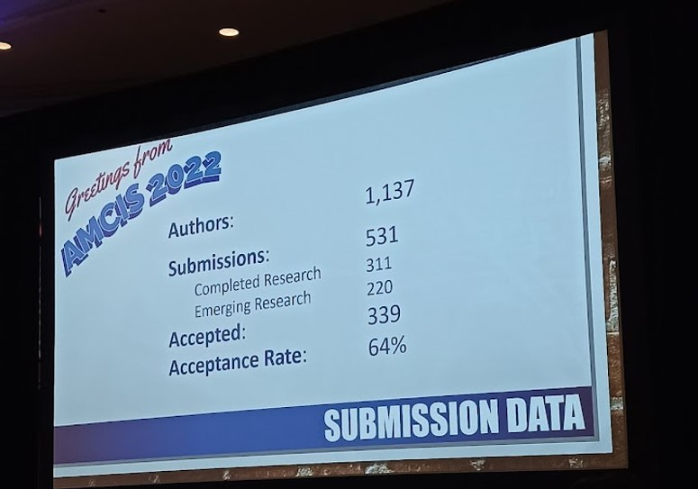

**How did I end up travelling to AMCIS 2022 Minneapolis?**

Long story short, I did my research project last year with AI and intelligent systems group of [Hasso Plattner Institute](https://hpi.de/). The outcome of that project was a research paper written along with my co-authors [Tolga Buz](https://www.linkedin.com/in/tolga-buz/) and [Prof. Gerard de Melo](http://gerard.demelo.org).
The paper was accepted at AMCIS 2022 and I got a generous support from the Prof. Gerard de Melo and HPI to travel and present our work.

[AMCIS 2022](https://amcis2022.aisconferences.org/) in Minneapolis was my first ever (in-person or virtual) conference attendance. This was a quite unique experience for me as a masters' student. This post briefly summarizes my experience. I presented my work on Reddit's finance communities and attended a workshop, paper sessions, doctoral student hang-outs and a panel. I will provide an overview of some of my favorite papers in later section of this post.

AMCIS is one of the leading conferences in the Information Systems/Management Information Systems domain. AMCIS 2022 took place in Minneapolis from 10th-14th August 2022. You can find submission data in a picture below. 

There were total 339 accepted papers out of those 311 were complete and 220 were emerging research papers. During the conference, there were at least 6 parallel paper sessions at any given time which made it difficult to attend many interesting paper sessions due to time clashes. I feel the paper sessions could have been scheduled more effectively.

## Codeless KNIME Workshop ##
My first day of the conference started with the codeless KNIME workshop. I had previously heard of KNIME as a data science tool but did not a get chance to use it. KNIME is a codeless data science platform which allows one to develop and deploy end-to-end ML solutions. I particularly liked the functionality of generating frontend directly from the tool once you are done building the model. If you are interested in learning more about KNIME, please check out this [link](https://www.knime.com/knime-analytics-platform).  In my opinion, this tool can help MIS researchers who are not familiar with programming to utilize ML/DL in their research.

## My Paper Presentation  ##

Presentation for our [paper](http://gerard.demelo.org/papers/wallstreetbets-social.pdf)  titled **"WallStreetBets Beyond GameStop, YOLOs, and the Moon: The Unique Traits of Reddit’s Finance Communities"** was scheduled on the later half of the very first day of the conference. 
Our work focuses on identifying unique traits of Reddit's finance communities such as r/stocks, r/investing and r/wallstreetbets. We utilized topic modelling and linguistic feature analysis to answer the research questions like What are the characteristics and differences of the selected communities regarding their content, topics, and language? Does the data of users who actively posted in all three communities provide valuable insights to confirm or contradict our findings?

We concluded our research with following finding,
* WSB is unique in terms of its language and terminology.
* Different finance-related communities could be valuable in order to identify important topics and signals among retail traders.
* Different Subreddits provide a nuanced picture of what moves retail traders with different risk affinity.
* None of the communities should be used as a single source of information due to their thematic focus.

My presentation went pretty well. There was relatively decent crowd in terms of numbers, although I expected better reaction from the audience for the meme i had put in my slides. :P

If you are interested in finding out more about our research, please follow this [link](https://aisel.aisnet.org/amcis2022/sig_sc/sig_sc/8/) to see the video of me explaining the paper in brief.
## Favorite Papers ##
Paper sessions were divided into different tracks based on "SIG - Special Interest Groups". In the below image, you can see the different SIGs.

I was particularly interested in SIGs 1) Social Computing and 2) SIG ODIS - Artificial Intelligence and Semantic Technologies for Intelligent Systems. 
AMCIS being management information system conference, the focus of technology related papers is more on extracting the value for businesses while applying the technology. So the focus is not the "Technology" itself, which is different from the core AI/CS conferences. This was interesting for me personally as I am always inspired by the application of technology and how the technology can solve some of the most difficult problems.

Some of my favorite applied AI/Natural Language Processing papers below,

#### [Using Explainable AI to Understand Bond Excess Returns](https://aisel.aisnet.org/amcis2022/sig_odis/sig_odis/5/) ####
This paper utilizes SHAP values to understand the bond excess returns. SHAP values answer the question of how a certain feature or combination of features has contributed to the prediction that a machine learning model made. To derive this contribution SHAP calculates how much a certain feature or a combination of features contributed to the specific prediction for a certain prediction target. For bond excess returns Macroeconomic factors such as interest rates were found to be effective in this research.

 
#### [Use of Emotions in Fake Review Detection](https://aisel.aisnet.org/amcis2022/sig_odis/sig_odis/2) ####
This paper presents the methods to identify fake reviews. To be honest, I was more interested in the part of the paper where they talk about the impact of the fake reviews on the entire sales metric. Some data points like one-star increase in rating can result in up to a 9% percent increase in revenue for restaurants (Luca, 2016), USD 250,000 spending on fake reviews may generate more than USD 5 million in sales (Marciano, 2021) and buying 1000 Amazon reviews can cost as low as USD 11000 (Dean, 2021) were eye-opening for me.

#### [Using Deep Learning for Identifying Social Media Customer Service Opportunities](https://aisel.aisnet.org/amcis2022/sig_sc/sig_sc/2) ####
In this paper, Authors demonstrate that the latest deep learning techniques for natural language processing (NLP) achieves a significant increase in performance over the previous state-of-the-art techniques (Preotiuc-Pietro et al. 2019) for Social Media Customer Service complaint classification. I believe more sophisticated NLP models could be utilized for Identifying Social Media Customer Service from different social media platforms and could be offered as API service to the organizations. This could be beneficial to social media teams across the companies.

#### [Do Social Media Influencers Enhance Opinion Polarization in the Digital Economy? A Study on Influencer Video Content](https://aisel.aisnet.org/amcis2022/sig_sc/sig_sc/6) ####
I have been getting interested in research relating to quantifying the value of YouTube influencer content lately. So naturally this paper was of interest to me. This paper could provide one approach to work with YouTube influencer data in general. This study investigates how influencer videos polarize the audience's opinions on promoted products, enriching our understanding of the impact of social media on public opinion polarization and guiding organizations in brand management.

#### [Deepfake Audio Detection](https://aisel.aisnet.org/amcis2022/sig_sec/sig_sec/23/) ####
Authors extracted audio features from real and synthesized audio files and determined that Mel-Frequency Cepstral Coefficients (MFCCs) in synthesized audio show a significant difference from the MFCCs in real audio. Using Deep Neural Networks (DNNs) authors trained classifiers to detect synthesized audio in different datasets, with highly successful results.
Using this time-based spectrogram, from the audio files, authors extracted the following features: MFCCs, RMS, Zero Crossing Rate, Chroma Frequency and Spectral Roll off. Out of 3 DNN model- CNN, RNN and MLP, CNN model, with 99% precision, 99% accuracy and 99% recall and the RNN model, with 97% precision, 98% accuracy and 99% recall identified synthesized audio with high precision, accuracy, and recall.

#### [Beyond MLOps: The Lifecycle of Machine Learning based Solutions](https://aisel.aisnet.org/amcis2022/sig_adit/sig_adit/9/) ####
This paper was awarded the 2nd best paper of the conference. This research as name suggests, goes beyond the typical technical MLOps lifecycle and talks about implications of integrating the ML solutions in products at the organizational level. The author participated in actual data science team meetings, interviewed data scientists, data science managers to understand how ML based solutions are affecting the product and the organization at large. I highly recommend going through this paper if you are planning to work in industry data science team. 

## Decision-Making with Real-time data - Panel ##

Towards the end of the conference, I found this fascinating panel. Panel speakers were interesting mix of people from industry and B-Schools. CEO of Datasembly presented the platform they offer to their customers like Walmart and target for real-time data intelligence. What [datasembly](https://datasembly.com/) does is quite genius in my opinion. They scrap the prices of the products from the local store websites of the grocery giants like Walmart and target and provide it as a platform as service to the competitors. 

## People and Places ##
AMCIS being my first ever conference, I was a bit unsure how to approach people. There were many small talks which materialized in further discussions about research and out of conference venue activities such as sightseeing in Minneapolis and going for meals etc. I must say, I enjoyed time spent with other attendees. Also, I added most of these folks on my LinkedIn. World is a small place, you never know when you would bump into each other. :)

On the last day of the conference, I was able to visit America's biggest mall "Mall of America", surprisingly I found the GameStop store there, GME to the moon!

## Conclusion ##
In conclusion to this post, I would say I had an amazing time attending AMCIS at Minneapolis. I attended some insightful paper sessions, panels and met MIS researchers and doctoral students from across the globe. The experience of attending sessions in-person, talking to authors and other researchers has a clear positive delta in terms of how it affects your own thinking about the field.
My best wishes to all the researchers who are already gearing up for the AMCIS 2023. :)
