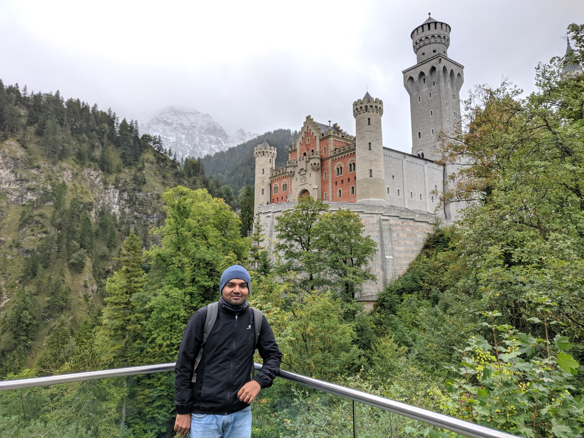

नमस्कार, मेरा नाम प्रतिक है || 

मैंने जर्मनी मै MSc डाटा विज्ञान की पढ़ाई की है \| इससे पहेले मे भारत मै बतोर सॉफ्टवेयर इंजीनियर काम कर चुका हु \|

मैंने अपनी उच्च शिक्षा कंप्युटर विज्ञान मे वडोदरा के महाराजा सायजीराव विश्वविध्यालय से प्राप्त करी है \|

Hi there, I'm Pratik.
  
I 'm ~~a [Data Science](https://www.uni-potsdam.de/en/university-of-potsdam) MSc student &~~ (a Software Engineer and aspiring Data Analyst / Data Scientist / ML engineer) based out of Berlin/Potsdam, Germany. 

I studied [Computer Science](http://www.msubaroda.ac.in) at Vadodara, India. I have a [Diploma](http://www.nirmauni.ac.in) in computer engineering.

Currently, Struggling to maintain my side project [Data About India.](http://dataaboutindia.wordpress.com/)

I have lived in : Ambaji, Karnavati (Ahmedabad), Vadodara, Gandhinagar, Mysuru, Bengaluru, Mumbai, Pune, Potsdam/Berlin.

I have travelled to : USA, Poland, Netherlands, France, Belgium, Spain, Czech Republic.

The best way to contact me is via email. (pratik4fp [at] gmail [dot] com) 

