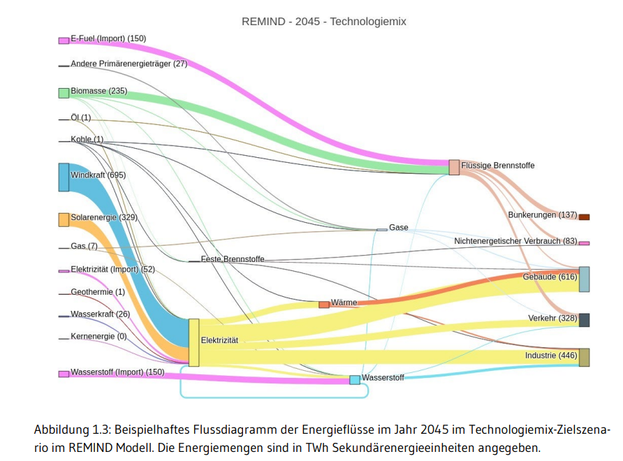
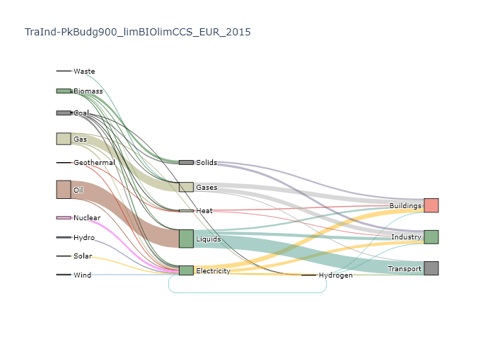
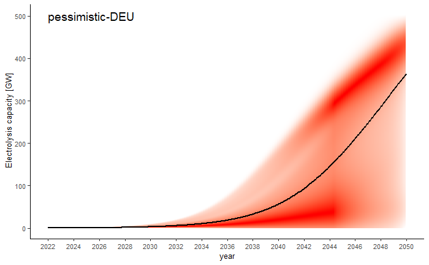
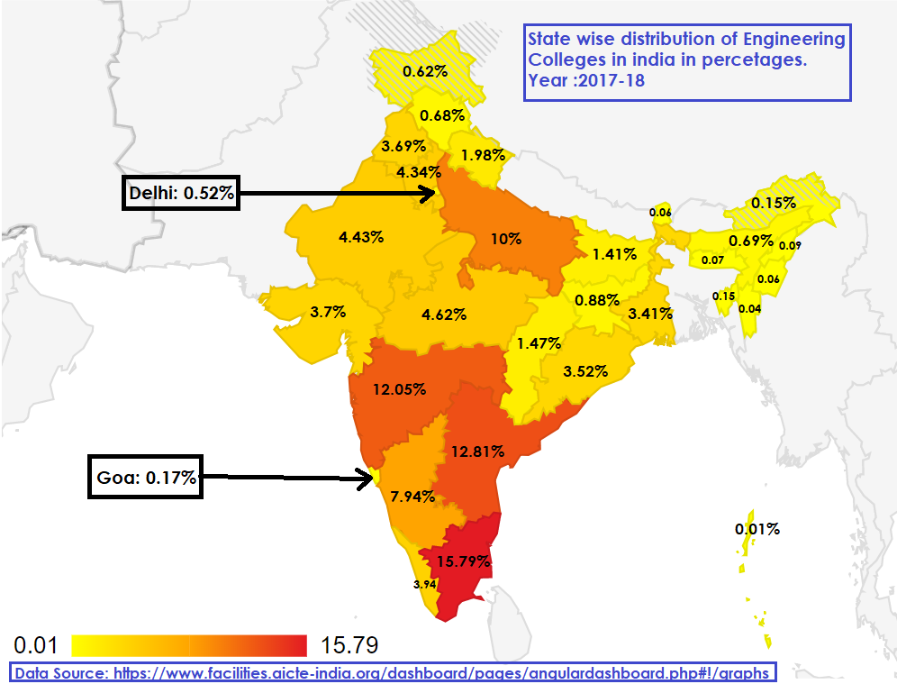
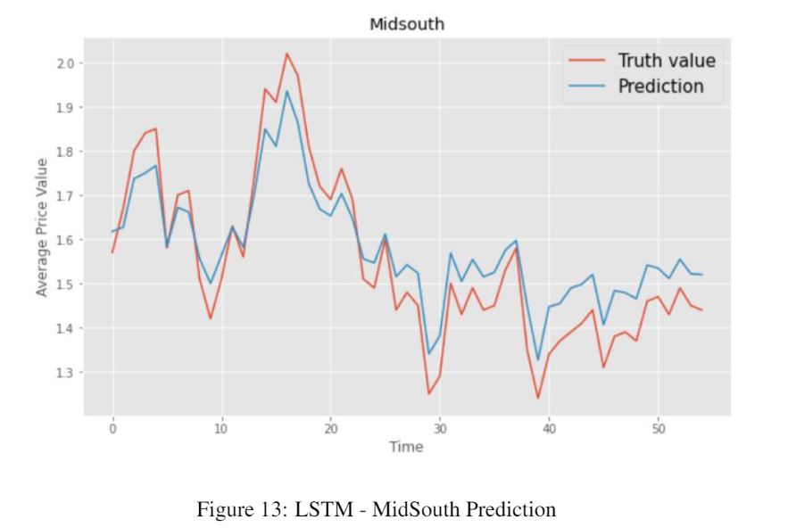

**Visit my [Google Scholar](https://scholar.google.com/citations?user=SLCVY6EAAAAJ&hl=en) profile for more details about  published work in the areas of MOOCs and Applied Machine Learning.**

**Visit [Academic Projects](/work.html) for my old Software development student projects.**

This page contains details about some selected data analysis and data visualization projects i have worked, both from my previous workplace ([PIK](https://www.pik-potsdam.de/en) - projects which are available in public domain) and personal projects.

# Data Analystics and Visualization Projects # 

## Sankey Diagrams for Electricity-Mix ##
I developed framework for generating sankey plots and time-series animation.
These plots became a part of [Deutschland auf dem Weg zur Klimaneutralität 2045 – Szenarien und Pfade im Modellvergleich Report.](https://ariadneprojekt.de/publikation/deutschland-auf-dem-weg-zur-klimaneutralitat-2045-szenarienreport/)
 

 

### _Technologies used_ ###
R, Python, Plotly, matplotlib, ggplot

## Bar-chart Racing Animation  ##
This is an ongoing visualization side project of mine where i collect, clean and visualize different datasets using barchart racing animation. Currently, exploring various datasets from India and Germany.
All Visualizations are available on [YouTube.](https://www.youtube.com/playlist?list=PLkGTRv6_dWh5tcKiznSyv1Hcaf69RFCgA)

### Few Visualizations: ###

* Indian Loksabha Election Results from 1951 to 2014
* Net Positive Migration to Germany from European Countries (1991-2020)
* Refugee Migration to Germany (2010-2020)
* Per Capita Net State Domestic Product in India (2004-2019)

<iframe width="560" height="315" src="https://www.youtube.com/embed/IcpvxORcvH8" title="YouTube video player" frameborder="0" allow="accelerometer; autoplay; clipboard-write; encrypted-media; gyroscope; picture-in-picture" allowfullscreen></iframe>
 

### _Technologies used_ ###
Javascript, Python, Excel, Openshot Video Editor, React, R, Python

## Visualy Weighted Density Plot ##
This Visualization is reproduction of *Burke, Hsiang, and Miguel (2015)*'s 
Economic Impact of Climate Change on the world [plot](https://web.stanford.edu/~mburke/climate/map.php) in R for different Use Cases.

 

### _Technologies used_ ###
R, Python, Plotly, matplotlib, ggplot

## Data About India - Geo-Spatial Maps ##
This Side project is my effort to answer some very basic questions about India using data visualizations and statistics. I constantly look for datasets and data sources related to India on web and try to come up with some insights and easy to understand visualizations. 

All Visualizations are available on my [Data About India Blog.](https://dataaboutindia.wordpress.com/)

 

### _Technologies used_ ###
R, Python, Plotly, matplotlib, ggplot, Javascript

# Machine Learning Projects # 

## Forest Fire Prediction ##
This project was a part of Machine Learning course during my MSc. 
Predict wildfires based on weather data of the Fire-Weather-Index (FWI).

### Dataset: ###
 Forest fire data from Montesinho natural park located in the Tras-os-Montes northeastregion of Portugal from January 2000 to December 2003. [[Paper]](https://www.researchgate.net/publication/238767143_A_Data_Mining_Approach_to_Predict_Forest_Fires_using_Meteorological_Data)

### Code: [GitHub](https://github.com/pratik98/Machine-LearningSummer2020/tree/master/Forest%20Fire%20Prediction%20Project) ###
  

## Time series forecasting for avocado prices ##
This project was a part of Deep Learning course durig my MSc. Applied various deep learning and time-series algorithms to predict price of a commodity.

### Dataset: ###
  The avocado dataset is available on the Hass Avocado Board website or [Kaggle.](https://www.kaggle.com/neuromusic/avocado-prices) 

### Code: [GitHub](https://github.com/pratik98/Deep-Learning-HPI-2020/tree/master/dl_Q1_project) ###

### Pre-print: [pdf](https://github.com/pratik98/Deep-Learning-HPI-2020/blob/master/dl_Q1_project/summary.pdf) ###
  

