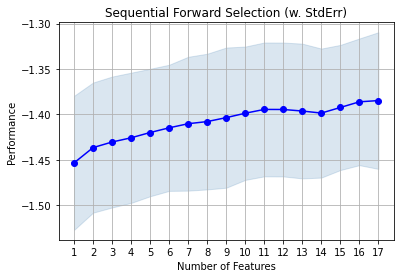

**Visit my [Google Scholar](https://scholar.google.com/citations?user=SLCVY6EAAAAJ&hl=en) profile for more details about  published work in the areas of MOOCs and Applied Machine Learning.**

This page contains some selected data analysis and data visualization projects, both from my previous workplaces (projects that are available in public domain) and personal projects.

# Data Analytics and Visualization Projects # 

## Dashboard for Federated Learning Experiments ##
Dashboard to visualize and comparatively analyze results of various FL experiments.
 

 

### _Technologies used_ ###
Python, stremlit, matplotlib, seaborn

## Sankey Diagrams for Electricity-Mix ##
I developed framework for generating sankey plots and time-series animation.
These plots became a part of [Deutschland auf dem Weg zur Klimaneutralität 2045 – Szenarien und Pfade im Modellvergleich Report.](https://ariadneprojekt.de/publikation/deutschland-auf-dem-weg-zur-klimaneutralitat-2045-szenarienreport/)
 

 

### _Technologies used_ ###
R, Python, Plotly, matplotlib, ggplot

## Barchart Racing Animation  ##
This is an ongoing visualization side project of mine where i collect, clean and visualize different datasets using barchart racing animation. Currently, exploring various datasets from India and Germany.
All Visualizations are available on [YouTube.](https://www.youtube.com/playlist?list=PLkGTRv6_dWh5tcKiznSyv1Hcaf69RFCgA)

### Few Visualizations: ###

* Indian Loksabha Election Results from 1951 to 2014
* Net Positive Migration to Germany from European Countries (1991-2020)
* Refugee Migration to Germany (2010-2020)
* Per Capita Net State Domestic Product in India (2004-2019)

<iframe width="560" height="315" src="https://www.youtube.com/embed/IcpvxORcvH8" title="YouTube video player" frameborder="0" allow="accelerometer; autoplay; clipboard-write; encrypted-media; gyroscope; picture-in-picture" allowfullscreen></iframe>
 

### _Technologies used_ ###
Javascript, Python, Excel, Openshot Video Editor, React, R, Python

## Visualy Weighted Density Plot ##
This Visualization is reproduction of *Burke, Hsiang, and Miguel (2015)*'s 
Economic Impact of Climate Change on the world [plot](https://web.stanford.edu/~mburke/climate/map.php) in R for different Use Cases.

 

### _Technologies used_ ###
R, Python, Plotly, matplotlib, ggplot

## Data About India - Geo-Spatial Maps ##
This Side project is my effort to answer some very basic questions about India using data visualizations and statistics. I constantly look for datasets and data sources related to India on web and try to come up with some insights and easy to understand visualizations. 

All Visualizations are available on my [Data About India Blog.](https://dataaboutindia.wordpress.com/)

 

### _Technologies used_ ###
XHTML, CSS, Javascript

# Machine Learning Projects # 

## WallStreetBets Beyond GameStop, YOLOs, and the Moon: The Unique Traits of Reddit’s Finance Communities ##

### Abstract: ###
While the effect of established social media on stock markets has been thoroughly investigated, the recent surge in retail investing and the emergence of different finance-related Reddit communities with unique new traits have led to new research questions. In this work, we aim to understand the linguistic and thematic characteristics and differences of the largest financial Reddit communities, r/WallStreetBets, r/stocks, and r/investing. Using different techniques for the analysis of linguistic features and topic modeling, we identify keywords and phrases that are most prominent in each community and determine each community’s thematic focus and risk affinity. An analysis of users that post on all of these communities confirm these findings, as they appear to adapt to the respective target audience when posting. The stock returns for each community prove consistent with their respective risk profile. Overall, we conclude that understanding these communities can help investors in making more informed investment decisions.

### Paper: [AMCIS 2022](https://aisel.aisnet.org/amcis2022/sig_sc/sig_sc/8/)
### Code: [GitHub](https://github.com/pratik98/WSB-Data-Science-Internship) ###

## Forest Fire Prediction ##
This project was a part of Machine Learning course during my MSc. 
Predict wildfires based on weather data of the Fire-Weather-Index (FWI).

### Dataset: ###
 Forest fire data from Montesinho natural park located in the Tras-os-Montes northeastregion of Portugal from January 2000 to December 2003. [[Paper]](https://www.researchgate.net/publication/238767143_A_Data_Mining_Approach_to_Predict_Forest_Fires_using_Meteorological_Data)

### Code: [GitHub](https://github.com/pratik98/Machine-LearningSummer2020/tree/master/Forest%20Fire%20Prediction%20Project) ###
  

## Time series forecasting for avocado prices ##
This project was a part of Deep Learning course durig my MSc. Applied various deep learning and time-series algorithms to predict price of a commodity.

### Dataset: ###
  The avocado dataset is available on the Hass Avocado Board website or [Kaggle.](https://www.kaggle.com/neuromusic/avocado-prices) 

### Code: [GitHub](https://github.com/pratik98/Deep-Learning-HPI-2020/tree/master/dl_Q1_project) ###

### Pre-print: [pdf](https://github.com/pratik98/Deep-Learning-HPI-2020/blob/master/dl_Q1_project/summary.pdf) ###
  

