I made my first website during 3rd year of my diploma engineering. it was plain **XHTML + CSS** website. since then i have enjoyed working on server-side web apps using **PHP, Ajax**; couple of mobile apps for **Android** and few mobile sites using **Jquery Mobile**. 

I have been fortunate to be a part of technical team of my college's annual techfest [FootPrints.](http://www.msu-footprints.org) I have worked on Event Registration system, Android app and mobile website for FootPrints.

I have also worked on [ Training and Placement portal](http://ftemsu-placements.org/) of my college.
 
Here are some more details about the projects that I have worked on -

# [NextBus - An SMS Based Application ] #
This SMS application allows user to send SMS to pre specified cell number with "origin/destination" query from cell phone and user would receive SMS containing bus timings of next available bus.
This is my 7th semester .NET project. The goal was to access internet from the low end device such as Nokia 1100. I developed SMS Gateway using Android and  Web Service using ASP.NET/C#. 

The Android SMS Gateway Receives SMS and Sends SOAP request to Web Service. Web Service replies with SOAP Response. Android APP then extracts details from SOAP Response and send to user via SMS.

 
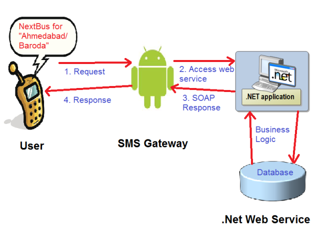

# Technologies used#
Android SDK, Java, C#, SOAP, .NET Framework, MS SQL Server, Twitter Bootstrap

# [FootPrints X3 - Registration Module](http://www.msu-footprints.org) #
I developed module for registering online for the different events of FootPrints. it supports automated generation of fee receipt in pdf format based on event selected by the participant. more than 10,000 participants registered for FootPrints X3 using this module. 

I extensively took care to prevent SQL injections and XSS attacks.

 
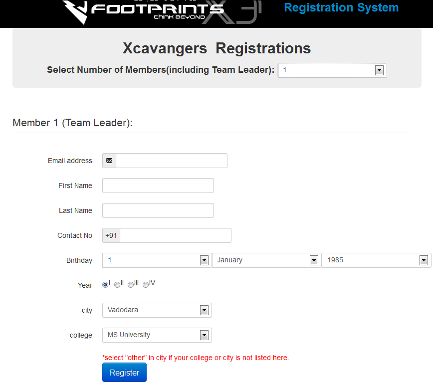

# Technologies used#
PHP, Wordpress, Ajax, MySQL, Twitter Bootstrap

# FootPrints Registration System  #
This is a backend of the FootPrints. i designed this system from scratch using beautiful twitter bootstrap. i revised the system with PHP Data Objects and OOP features of PHP. 

##few features:

* Reports generation based on event
	* by college
	* by department
	* by fees status etc.
* Generating and Emailing fee receipt
* Online elimination test results
* Selection of Participants 
* Excelsheet generation etc.

this system successfully handled database of over 10,000 students.

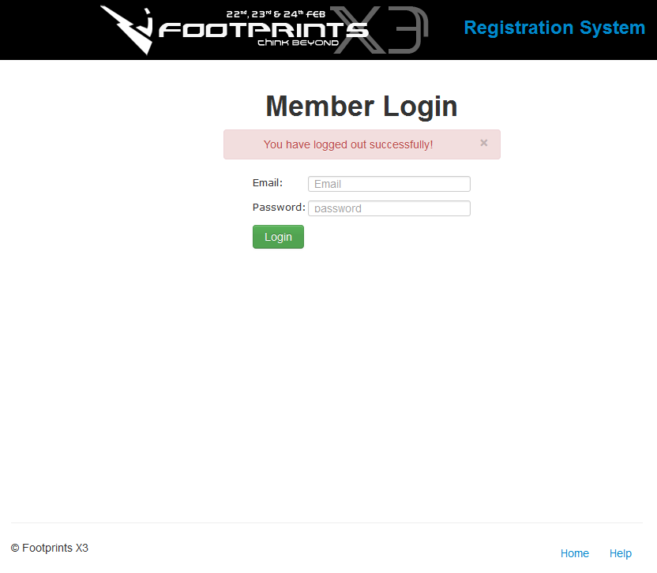
 
 
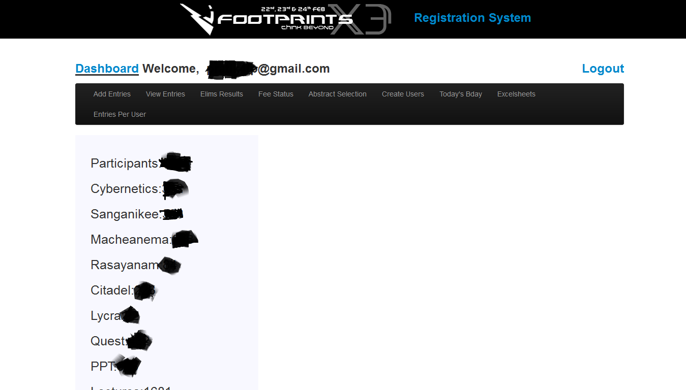

# Technologies used#
PHP (OOP), Ajax, MySQL DB, Twitter Bootstrap

# [FootPrints X3 :: Mobile Website](http://m.msu-footprints.org)  #
The first ever mobile website of FootPrints. 
 
 

# Technologies used#
PHP, JQuery Mobile

# FootPrints X3 :: Android App - [Download](http://www.msu-footprints.org/2013/FootPrints.apk)  #
The first ever Android app of FootPrints. the app and mobile site got featured in Local news paper. 
 
 
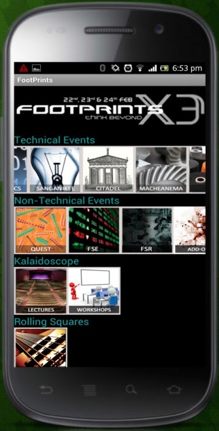

# Technologies used#
Android SDK, XML, Sqlite

# FootPrints X2 :: LAN Based Coding Judge   #
This is a simulation of "fastest fingers first" system we see in television show KBC. The System was used in final round of programming competition "Runtime" which was held in FootPrints X2. 
 
 
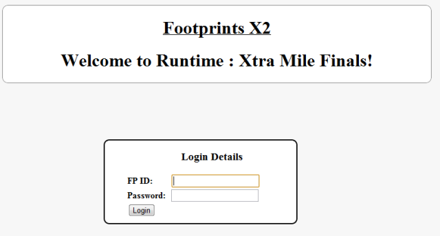
 
 
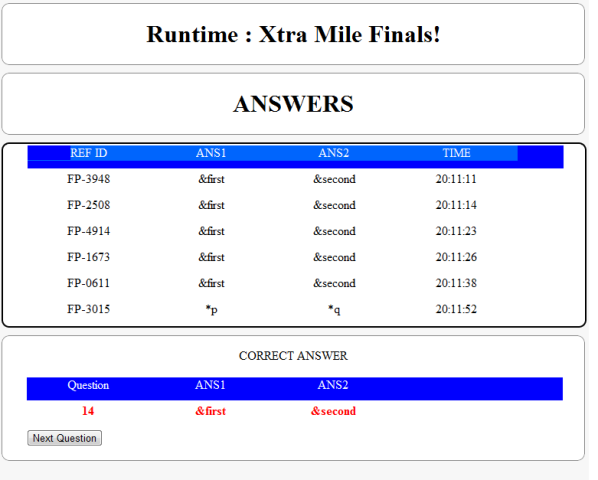

# Technologies used#
PHP, HTML5, CSS3, MySql

# Abhaas #
Abhaas is a faculty feedback management desktop application which can be used to assess the feedback received from students about faculties.

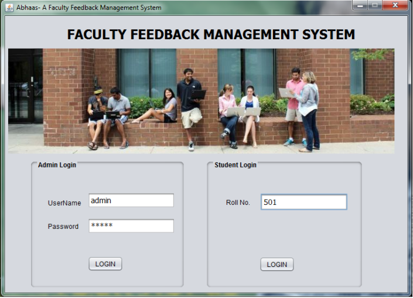

# Technologies used#
java, swing, oracle DB

# News on Go :: Android app #
This is a first ever android app i developed. the intension was more of learning than developing something useful. This is fully fuctional RSS Reader. this app was developed as part of academics in final year of diploma engineering.

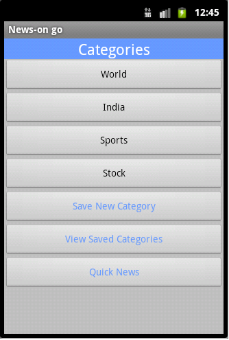

# Technologies used#
Android sdk, XML, Sqlite

# waytoconnect :: Open Discussion Forum #
This is an open discussion forum for my institute i developed in PHP and MySQL DB as part of academics in third year of my diploma engineering. 

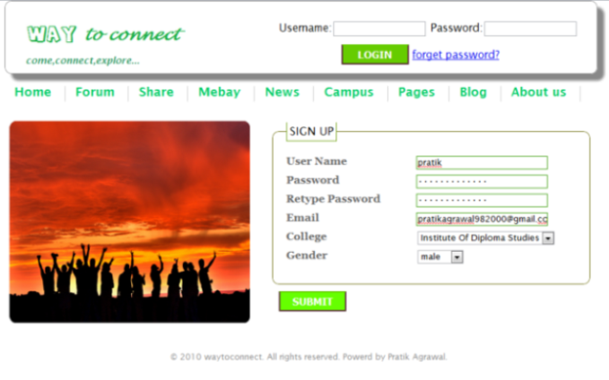
 
 
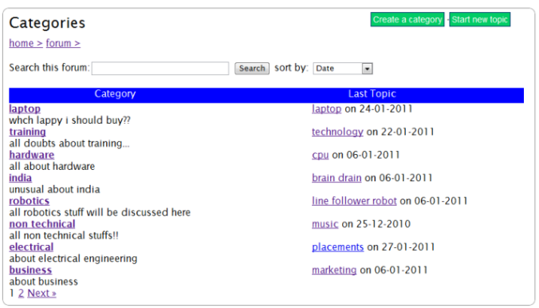

# Technologies used#
PHP, MySQL

# Blog.IT :: E-diary #

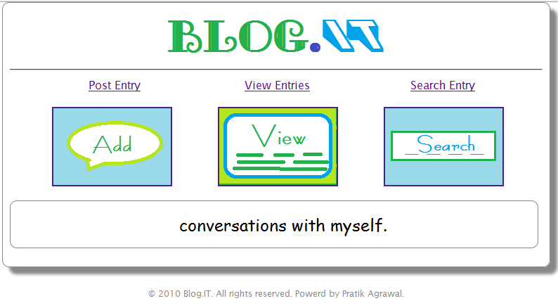

# Technologies used#
PHP, MySQL