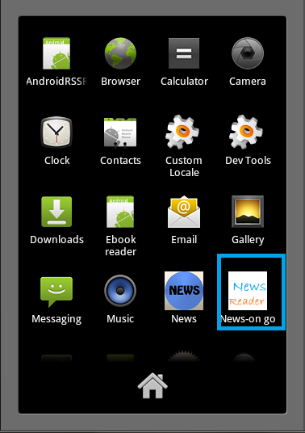

I made my first website during 3rd year of my diploma engineering. it was plain **XHTML + CSS** website. since then i have enjoyed working on server-side web apps using **PHP, Ajax**; couple of mobile apps for **Android** and few mobile sites using **Jquery Mobile**. 

I have been fortunate to be a part of technical team of my college's annual techfest [FootPrints.](http://www.msu-footprints.org) I worked on Event Registration system, Android app and mobile website for FootPrints.

Presently, i m part of [ Training and Placement cell](http://ftemsu-placements.org/) of my college and maintaining placement portal.
 
Here are some more details about the projects that I have worked on -

# [FootPrints X3 - Registration Module](http://www.msu-footprints.org) #

# Technologies used#
PHP, Wordpress, Ajax, MySQL, Twitter Bootstrap

# FootPrints Registration System  #

# Technologies used#
PHP (OOP), Ajax, MySQL DB, Twitter Bootstrap

# [FootPrints X3 :: Mobile Website](http://m.msu-footprints.org)  #

# Technologies used#
PHP, JQuery Mobile

# FootPrints X3 :: Android App - [Download](http://www.msu-footprints.org/2013/FootPrints.apk)  #

# Technologies used#
Android sdk, XML, Sqlite

# Abhaas #
Abhaas is a faculty feedback management desktop application which can be used to assess the feedback received from students about faculties.

# Technologies used#
java, swing, oracle DB

# News on Go :: Android app #

# Technologies used#
Android sdk, XML, Sqlite

# waytoconnect :: Open Discussion Forum #

# Technologies used#
PHP, MySQL

# Blog.IT :: E-diary #

# Technologies used#
PHP, MySQL